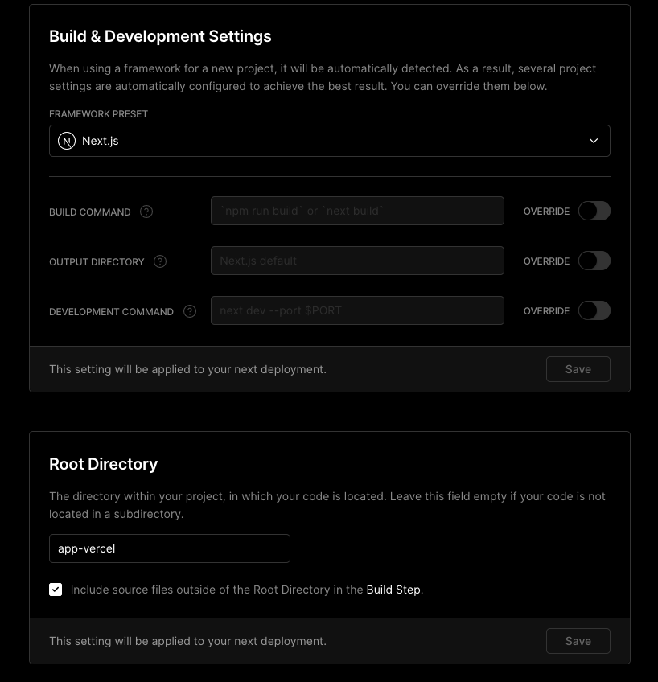

# How to run app the app?

`yarn && yarn --cwd app-vercel && yarn --cwd app-vercel dev`

# The problem on Vercel

I have the following setup:

The problem is that the `babel.config.js` file (in the root directory) imports a `babel-plugin-ramda` which it fails to resolve as there are no `node_modules` in the root folder after Vercel build. (This `babel.config.js` file is extended in `app-vercel/babel.config.js`)
